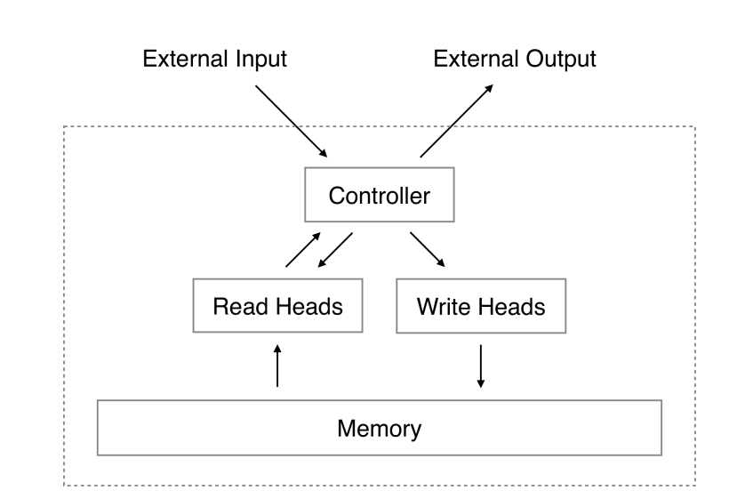

# Memory Augmented Neural Network


This is my personal implementation of the Memory Augmented Neural Network introduced as the [Neural Turing Machine](https://arxiv.org/abs/1410.5401)


### **Setup**
To set up the environment, follow these steps:<br>
1) ```conda create --name env pip```<br>
2) ```conda activate env```<br>
3) ```pip install -r requirements.txt```<br>

### **Usage**
In order to the models, open the notebooks ```run_memory_network.ipynb```
